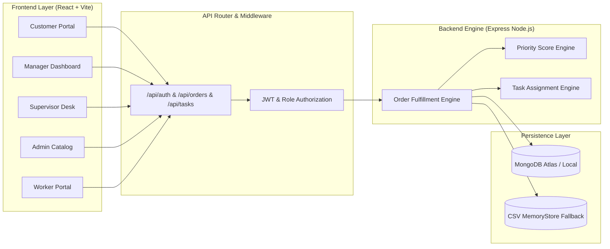
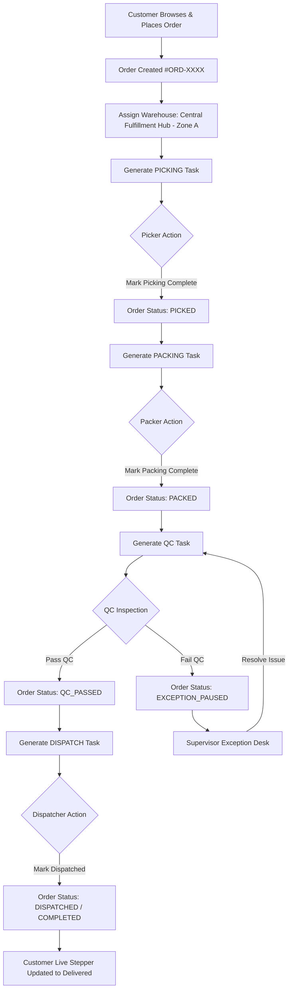

# Smart Warehouse Operations

### End-to-End Order Traceability & Warehouse Fulfillment Platform

[](https://smart-warehouse-ops-mocha.vercel.app/)
[](https://github.com/Mounikadevichennam/smart-warehouse-ops)
[](https://nodejs.org/)
[](https://react.dev/)

**Smart Warehouse Operations** is an integrated e-commerce and logistics fulfillment platform designed to bridge the visibility gap between customer order placement and warehouse execution. It connects an Amazon/Flipkart-style customer shopping portal directly to a multi-stage warehouse fulfillment pipeline (`Picking` → `Packing` → `QC` → `Dispatch`), providing 100% real-time operational traceability and worker accountability across every order.

---

## 🚀 Live Links

- **Live Production Application**: [**https://smart-warehouse-ops-mocha.vercel.app/**](https://smart-warehouse-ops-mocha.vercel.app/)
- **Source Code Repository**: [**https://github.com/Mounikadevichennam/smart-warehouse-ops**](https://github.com/Mounikadevichennam/smart-warehouse-ops)

---

## 1. Problem Statement

In traditional supply chains and fragmented warehouse management systems, tracking an order's internal lifecycle creates severe operational blind spots:

- **What product was ordered?**
- **When was the order created?**
- **Which specific warehouse and storage bin is handling it?**
- **Where is the physical item right now?**
- **Who picked the item from the rack?**
- **Who packed and sealed the package?**
- **Who conducted the quality inspection?**
- **Who completed the final dispatch?**
- **When did each individual stage complete?**
- **What is the current live status?**

Without unified traceability, customer support teams cannot answer delivery inquiries, warehouse managers cannot identify throughput bottlenecks, and operational accountability is lost.

---

## 2. Solution

Our platform unifies customer order creation and internal warehouse execution into a **single connected lifecycle**:

```
Customer Shop ➔ Add to Cart ➔ Checkout ➔ Order Placed ➔ Warehouse Assigned
                                                                 │
Customer Live Tracking ◄─── Dispatched ◄─── QC ◄─── Packing ◄─── Picking
```

- **Customer Experience**: Customers shop products, select sizes/quantities, place orders, and track live stage milestones (`Order Placed` → `Picking` → `Packing` → `QC Passed` → `Dispatched`).
- **Warehouse Operations**: Warehouse workers and managers receive auto-assigned tasks, record completions with worker identities and timestamps, and resolve exceptions—updating the customer's live order tracking state automatically.

---

## 3. Key Highlight / USP

> **"One Order. One Source of Truth. Complete Visibility."**

The platform tracks every order through a single source of truth across all roles:

```
Customer ➔ Warehouse ➔ Picker ➔ Packer ➔ QC Inspector ➔ Dispatcher ➔ Customer
```

Every stage completion automatically records and persists:
- **Responsible Worker Name & ID**
- **Action Completion Timestamp**
- **Order Status & Stage Milestone**
- **Assigned Warehouse & Location Bin Coordinates** (`Zone A • Rack 01 • Bin 04`)
- **Full Chronological Activity Audit Trail**

---

## 4. Customer Experience

### Customer Shopping Flow

1. **Browse Catalog**: Explore products with realistic images, INR prices (₹), star ratings, reviews, and stock availability.
2. **View Product Details**: Inspect descriptions, pricing, and category specs.
3. **Select Variants**:
   - **Apparel**: Choose size (`XS`, `S`, `M`, `L`, `XL`).
   - **Footwear**: Choose shoe size (`7 UK` – `11 UK`).
   - **Electronics & Accessories**: Adjust quantity (`- 1 +`).
4. **Add to Cart & Checkout**: View cart subtotal, free warehouse shipping, and enter shipping address/pincode.
5. **Place Order**: Instantly generates a unique Order ID (`#ORD-XXXX`), saves customer identity, routes to `Central Fulfillment Hub - Zone A`, and creates an initial warehouse `PICKING` task.

---

## 5. Order Tracking

Customers click **"Track Order"** on any placed order to view a live 5-stage milestone stepper:

$$\begin{aligned}
\checkmark \; &\mathbf{1.\; Order\; Placed\; \&\; Warehouse\; Assigned} && (\text{Central Fulfillment Hub - Zone A}) \\
\checkmark \; &\mathbf{2.\; Warehouse\; Item\; Picking} && (\text{Completed Timestamp}) \\
\checkmark \; &\mathbf{3.\; Order\; Packaging\; \&\; Securing} && (\text{Completed Timestamp}) \\
\checkmark \; &\mathbf{4.\; Quality\; Control\; \&\; Inspection} && (\text{Passed Timestamp}) \\
\checkmark \; &\mathbf{5.\; Dispatch\; \&\; Transit\; Delivery} && (\text{Dispatched Timestamp})
\end{aligned}$$

- **Real-Time Data**: Automatically reflects updates from the backend when warehouse workers advance stages.
- **Privacy Scoped**: Customers view only their own orders without exposing internal staff emails or sensitive management notes.

---

## 6. Warehouse Operations

### 📦 Picking Workflow
- Idle Pickers receive tasks based on order priority score and deadline.
- Picker navigates to bin location (`Zone A • Rack 01 • Bin 04`), picks the item, and clicks **"MARK PICKING COMPLETE"**.
- System records **Picker identity** and **timestamp**, updates status to `PICKED`, and generates a `PACKING` task.

### 🎁 Packing Workflow
- Packer receives the picked order and verifies package contents.
- Clicking **"MARK PACKING COMPLETE"** records **Packer identity** and **timestamp**, updates status to `PACKED`, and generates a `QC` task.

### 🛡️ Quality Control (QC) Workflow
- QC Inspector conducts physical and barcode inspection.
- **PASS QC**: Records **QC Auditor identity** and **timestamp**, updates status to `QC_PASSED`, and generates a `DISPATCH` task.
- **FAIL QC**: Logs an operational exception, sets status to `EXCEPTION_PAUSED`, and alerts Supervisors.

### 🚚 Dispatch Workflow
- Dispatcher scans shipping label and confirms courier handoff.
- Clicking **"MARK DISPATCH COMPLETE"** records **Dispatcher identity** and **timestamp**, deducts stock, and marks order as `DISPATCHED` / `COMPLETED`.

---

## 7. Order Traceability Audit Example

When a Manager or Supervisor audits **`#ORD-1025`**, the system displays the complete operational journey:

```
ORDER #ORD-1025
Customer: Apex Logistics
Product: Silk Designer Dress (Qty: 1)
Warehouse: Central Fulfillment Hub - Zone A

✓ 1. Order Placed & Warehouse Assigned
   10:15 AM

✓ 2. Picking
   Suresh Reddy (Picker) • 10:42 AM

✓ 3. Packing
   Priya Naidu (Packer) • 11:18 AM

✓ 4. Quality Control
   Meena Devi (QC Inspector) • 11:46 AM • Status: QC_PASSED

✓ 5. Dispatch
   Arjun Singh (Dispatcher) • 12:10 PM

CURRENT STATUS: DISPATCHED
```

---

## 8. User Roles & Matrix

| Role | Responsibility |
|---|---|
| **Customer** | Browse product catalog, add to cart, checkout, place orders, and track live order progress |
| **Manager** | Complete executive warehouse metrics, order journey traceability, bottleneck alerts, and pipeline monitoring |
| **Supervisor** | Active worker monitoring, task reassignments, and exception desk resolution |
| **Admin** | Master product catalog, inventory restocking, warehouse locations, and user management |
| **Picker** | Execute assigned item picking tasks from designated zone bin coordinates |
| **Packer** | Package picked orders into shipping cartons and mark packing complete |
| **QC Inspector** | Conduct quality inspection, approve (`PASS QC`), or report defective items (`FAIL QC`) |
| **Dispatcher** | Hand off inspected packages to transit carriers and mark dispatch complete |

---

## 9. Warehouse Structure

Items and inventory in the system follow a 4-tier physical spatial hierarchy:

$$\text{Warehouse Hub} \longrightarrow \text{Zone (A/B/C)} \longrightarrow \text{Rack (01/02/03)} \longrightarrow \text{Bin (01--12)}$$

- **Pick Route Optimization**: Picking tasks display exact bin locations (`Zone A • Rack 01 • Bin 04`) so pickers navigate directly to stock items.
- **Capacity Tracking**: Warehouse locations track max capacity vs. current occupancy.

---

## 10. Exception Management

When an anomaly occurs during fulfillment (e.g., missing stock, damaged item, or QC failure):

1. Worker clicks **"Report Exception"** and submits the issue type and description.
2. System flags order as `EXCEPTION_PAUSED`, halting automated pipeline progression.
3. Exception appears on the **Supervisor Exception Desk**.
4. Supervisor reviews resolution options (e.g., reassigning bin, replacing item, or cancelling order) and clicks **"Resolve Exception"** to resume fulfillment.

---

## 11. System Architecture



---

## 12. Technology Stack

### Frontend
- **Framework**: React 18 (Vite 5 build tooling)
- **UI Components & Icons**: Lucide React (`lucide-react`)
- **Styling**: Manus-inspired Light SaaS Design System (`index.css`), Vanilla CSS design tokens
- **Routing**: State-driven role layout router (`App.jsx`)

### Backend
- **Runtime**: Node.js (v18+)
- **Framework**: Express.js (v4.19)
- **Authentication**: JSON Web Tokens (`jsonwebtoken`) & password hashing (`bcryptjs`)
- **Services**: Custom priority calculation engine, task assignment engine, bottleneck analytics engine

### Database & Storage
- **Primary Database**: MongoDB Atlas / local MongoDB (via Mongoose v8.3)
- **Offline Fallback Engine**: Built-in CSV In-Memory Dataset Engine (`memoryStore.js`), enabling offline hackathon execution without DB server requirements

### Deployment
- **Platform**: Vercel (Vercel Services monorepo routing architecture)
- **Version Control**: Git & GitHub

---

## 13. Project Structure

```
smart-warehouse-ops/
├── vercel.json                 # Root Vercel Services monorepo routing config
├── .gitignore                  # Exclusion rules for secrets & node_modules
├── README.md                   # Project documentation
│
├── frontend/                   # React + Vite Web Application
│   ├── public/                 # Static public assets
│   ├── src/
│   │   ├── components/         # Modal, Stepper, Traceability & UI components
│   │   ├── context/            # AuthContext state provider
│   │   ├── pages/              # CustomerPortal, Manager, Supervisor, Admin, Worker pages
│   │   ├── services/           # API fetch client wrapper (api.js)
│   │   ├── styles/             # Global design tokens and Manus SaaS stylesheet
│   │   ├── App.jsx             # Root App component and role dashboard router
│   │   └── main.jsx            # Vite entry point
│   ├── package.json
│   └── vite.config.js
│
├── backend/                    # Node.js + Express REST API Server
│   ├── server.js               # Server entry point & Express app export
│   ├── .env.example            # Environment variables template
│   ├── package.json
│   └── src/
│       ├── config/             # Database connection logic (db.js)
│       ├── controllers/        # Order, Task, Auth, Exception & Inventory controllers
│       ├── middleware/         # Auth protect, role authorize, & error handler
│       ├── models/             # Mongoose schemas (Order, User, Worker, Task, Product, etc.)
│       ├── routes/             # Express API route modules
│       ├── scripts/            # Database seed scripts
│       └── services/           # Priority engine, task assignment, & memoryStore engine
│
└── seed-data/                  # CSV Datasets for offline fallback execution
    ├── users.csv               # Demo management & customer user accounts
    ├── workers.csv             # Demo warehouse workers (Picker, Packer, QC, Dispatch)
    ├── products.csv            # Catalog product items & stock
    ├── orders.csv              # Initial demo orders
    ├── order_items.csv         # Order line items
    ├── tasks.csv               # Active & pending warehouse tasks
    ├── warehouse_locations.csv # Bin location coordinates
    ├── exceptions.csv          # Reported operational exceptions
    ├── activity_history.csv    # Chronological activity logs
    └── restock_requests.csv    # Inventory restock requests
```

---

## 14. Data / Seeding

The application ships with complete seed datasets located in `seed-data/`:

- `users.csv`: Demo management users (`MANAGER`, `SUPERVISOR`, `ADMIN`, `CUSTOMER`).
- `workers.csv`: Registered warehouse workers (`Suresh Reddy`, `Priya Naidu`, `Meena Devi`, `Arjun Singh`).
- `products.csv`: E-commerce product catalog with SKUs, stock levels, and bin locations.
- `orders.csv` & `order_items.csv`: Sample active and historical orders.
- `warehouse_locations.csv`: Zone, rack, and bin capacity coordinates.
- `tasks.csv` & `exceptions.csv`: Active fulfillment task queue and exception logs.

When MongoDB is unavailable, `connectDB()` automatically boots the **In-Memory CSV Dataset Engine**, parsing all CSV datasets so the application runs offline.

---

## 15. Order Lifecycle Flow



---

## 16. Hackathon Live Demo Flow

To demonstrate the complete end-to-end integration:

$$\begin{array}{rll}
\mathbf{Step\; 1:} & \text{Login as Customer} & (\texttt{customer@demo.com} \;/\; \texttt{Demo@123}) \\
\mathbf{Step\; 2:} & \text{Browse Shop} & \text{Select "Silk Designer Dress" (₹1,499), select Size M, click Add to Cart} \\
\mathbf{Step\; 3:} & \text{Checkout} & \text{Fill address details and click "PLACE ORDER"} \\
\mathbf{Step\; 4:} & \text{Order Created} & \text{System displays Order ID } \#\text{ORD-0997 assigned to Zone A} \\
\mathbf{Step\; 5:} & \text{Login as Picker} & (\texttt{picker1@warehouse.com} \;/\; \texttt{worker123}, \text{Role: Picker}) \\
\mathbf{Step\; 6:} & \text{Complete Picking} & \text{Click "MARK PICKING COMPLETE" on } \#\text{ORD-0997} \\
\mathbf{Step\; 7:} & \text{Login as Customer} & \text{Track Order } \rightarrow \text{Milestone 2 shows Picked by Suresh Reddy} \\
\mathbf{Step\; 8:} & \text{Login as Packer} & (\texttt{packer1@warehouse.com} \;/\; \texttt{worker123}, \text{Role: Packer}) \\
\mathbf{Step\; 9:} & \text{Complete Packing} & \text{Click "MARK PACKING COMPLETE" on } \#\text{ORD-0997} \\
\mathbf{Step\; 10:} & \text{Login as QC} & (\texttt{qc1@warehouse.com} \;/\; \texttt{worker123}, \text{Role: QC}) \\
\mathbf{Step\; 11:} & \text{Pass QC} & \text{Click "PASS QC" on } \#\text{ORD-0997} \\
\mathbf{Step\; 12:} & \text{Login as Dispatcher} & (\texttt{dispatch1@warehouse.com} \;/\; \texttt{worker123}, \text{Role: Dispatch}) \\
\mathbf{Step\; 13:} & \text{Complete Dispatch} & \text{Click "MARK DISPATCH COMPLETE" on } \#\text{ORD-0997} \\
\mathbf{Step\; 14:} & \text{Login as Customer} & \text{Track Order } \rightarrow \text{Displays DISPATCHED with full worker traceability!}
\end{array}$$

---

## 17. Features

- **Customer E-Commerce Shopping Portal** (Catalog, product variants, size selectors, shopping cart, checkout)
- **Live Order Milestone Stepper** (Real-time tracking of picking, packing, QC, and dispatch)
- **Full Operational Order Traceability** (Persistent worker identity names & action timestamps)
- **Automated Task Assignment Engine** (Assigns tasks to available workers based on priority & SLA)
- **Dynamic Priority Scoring Engine** (Calculates scores based on delivery deadline and transit days)
- **Multi-Role Executive Dashboards** (Manager, Supervisor, Admin, Worker)
- **Exception Reporting & Desk** (Report picking/packing/QC issues, pause order, supervisor resolution)
- **Inventory & Location Bin Coordinates** (Zone, rack, bin capacity & stock tracking)
- **Restock Request & Approval Workflow** (Request low-stock items & confirm restock receiving)
- **Offline CSV Fallback Engine** (Instant boot execution without external database dependencies)
- **Vercel Multi-Service Deployment Config** (Production ready static & serverless routing)

---

## 18. Setup / Local Development

### Prerequisites
- **Node.js**: `v18.x` or higher
- **npm**: `v9.x` or higher

### 1. Clone Repository
```bash
git clone https://github.com/Mounikadevichennam/smart-warehouse-ops.git
cd smart-warehouse-ops
```

### 2. Backend Setup
```bash
cd backend
npm install
npm start
```
*Backend runs on `http://localhost:5000` (starts automatically in CSV fallback mode if local MongoDB is offline).*

### 3. Frontend Setup
Open a second terminal:
```bash
cd frontend
npm install
npm run dev
```
*Frontend runs on `http://localhost:3000`.*

### Environment Variables
Environment settings can be configured via `backend/.env` (see `backend/.env.example` template):
```ini
PORT=5000
MONGODB_URI=mongodb://127.0.0.1:27017/smart_warehouse
JWT_SECRET=super_secret_warehouse_jwt_key_2026
NODE_ENV=development
```
*(Sensitive `.env` files are excluded via `.gitignore`).*

---

## 19. Demo Accounts

| Role | Email | Password | Role Selector / Notes |
|---|---|---|---|
| **Customer** | `customer@demo.com` | `Demo@123` | Customer Shopping & Live Tracking |
| **Manager** | `manager@warehouse.com` | `admin123` | Executive Dashboard |
| **Supervisor** | `supervisor@warehouse.com` | `admin123` | Exception Desk |
| **Admin** | `admin@warehouse.com` | `admin123` | Master Catalog & User Admin |
| **Picker Worker** | `picker1@warehouse.com` | `worker123` | Select `Picker` |
| **Packer Worker** | `packer1@warehouse.com` | `worker123` | Select `Packer` |
| **QC Worker** | `qc1@warehouse.com` | `worker123` | Select `QC` |
| **Dispatch Worker** | `dispatch1@warehouse.com` | `worker123` | Select `Dispatch` |

---

## 20. Security & Privacy

- **Environment Protection**: All database connection URIs and JWT secrets are stored in environment variables and excluded from version control via `.gitignore`.
- **Role-Based Access Control (RBAC)**: Backend middleware (`authMiddleware.js` & `roleMiddleware.js`) validates JWT tokens and restricts endpoint access by role.
- **Customer Data Privacy**: Customer order queries are scoped strictly by authenticated account identity (`customerEmail`).
- **Data Sanitization**: Customer tracking responses strip internal staff emails, internal management notes, and system logs.

---

## 21. Future Enhancements

- **Real-Time WebSockets**: Push instant socket notifications to customer tracking pages when workers complete tasks.
- **Predictive Demand Forecasting**: AI/ML analytics to predict seasonal SKU order spikes.
- **Barcode & QR Scanner**: Camera scanning integration in worker portals for instant bin/SKU verification.
- **Delivery ETA Machine Learning**: Predictive transit time estimation based on historical courier performance.
- **IoT Warehouse Sensors**: Automated temperature and humidity monitoring for sensitive inventory.

---

## 22. Project Status

**Hackathon MVP — Fully Functional Prototype**

The core end-to-end customer-to-warehouse order journey, priority scoring, automated task assignment, worker identity recording, live tracking stepper, and operational dashboards are 100% implemented, tested, and deployed live.

---

## 23. Team

- **Team Lead**: Mounika Devi Chennam
- **Repository**: [https://github.com/Mounikadevichennam/smart-warehouse-ops](https://github.com/Mounikadevichennam/smart-warehouse-ops)
